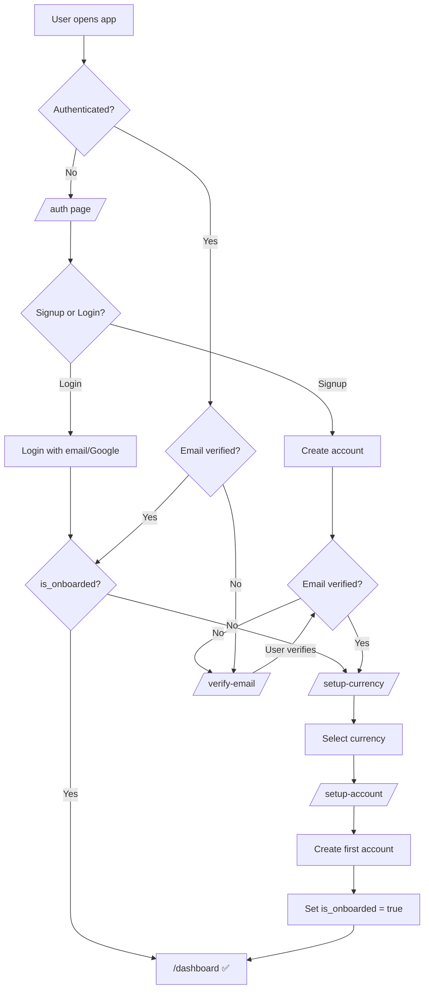

## User Flow Diagram

```mermaid
flowchart TD
    A[User opens app] --> B{Authenticated?}
    B -- No --> C[/auth page/]
    C --> D{Signup or Login?}
    D -- Login --> E[Login with email/Google]
    E --> F{is_onboarded?}
    F -- Yes --> G["/dashboard ✅"]
    F -- No --> H[/setup-currency/]
    D -- Signup --> I[Create account]
    I --> J{Email verified?}
    J -- No --> K[/verify-email/]
    K --> |User verifies| J
    J -- Yes --> H
    H --> L[Select currency]
    L --> M[/setup-account/]
    M --> N[Create first account]
    N --> O["Set is_onboarded = true"]
    O --> G
    
    B -- Yes --> P{Email verified?}
    P -- No --> K
    P -- Yes --> F
```

---